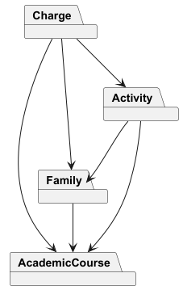

# Domain model diagram

[AcademicCourse package](AcademicCoursePackage/AcademicCoursePackage.md)

[Family package](FamilyPackage/FamilyPackage.md)

[Activity package](ActivityPackage/ActivityPackage.md)

[Charge package](ChargePackage/ChargePackage.md)

[Importation package](ImportationPackage/ImportationPackage.md)
